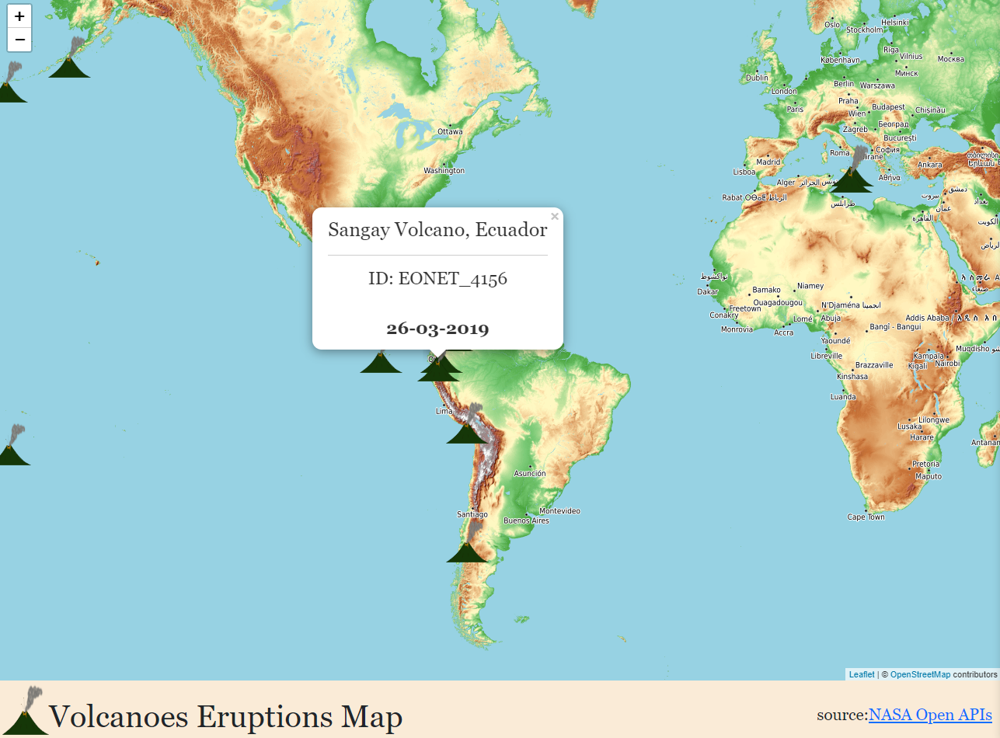

# Volcanics Erutions Map Tracker using NASA Open APIs, with React-Leaflet.

### Source:
Open APIs NASA: [https://api.nasa.gov/](https://api.nasa.gov/)

EONET: The Earth Observatory Natural Event Tracker: [https://eonet.gsfc.nasa.gov/api/v2.1/events](https://eonet.gsfc.nasa.gov/api/v2.1/events)

Update: npm run deploy

gh-pages 

 "homepage":"http://JosepAnSabate.github.io/React-Leaflet-World-Oil-Production-Deployment"

   "scripts": {
       
    "predeploy":"npm run build",
    "deploy":"gh-pages -d build",